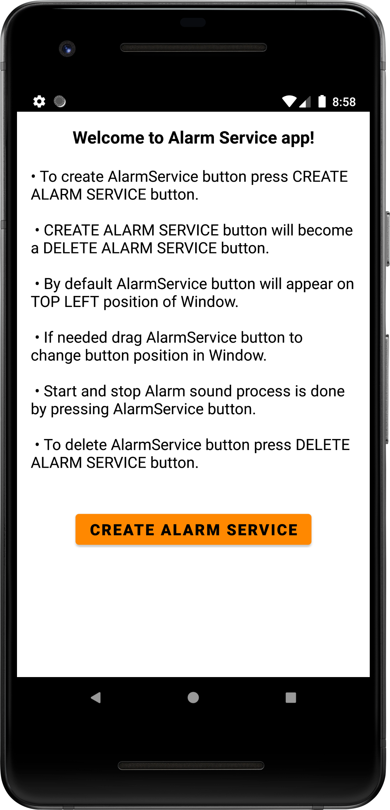

# AlarmService

My solution of the test task from a company

The task:

Create a mobile application consisting of:

- Alarm Service

- Application to manage the Service

The user interface of the application should consist of one 24x24 dp button with a status symbol (play / stop) in the upper left corner of the screen in front of all windows.

The application should not interfere in user's work with other applications and OS. 

Pressing the button starts the Service of periodic playback of any sound signal, pressing the button again terminates the Service.

Requirements:

Development language Kotlin, Java.

Android Studio development environment.

Compatible with Android 8 and above.

  
